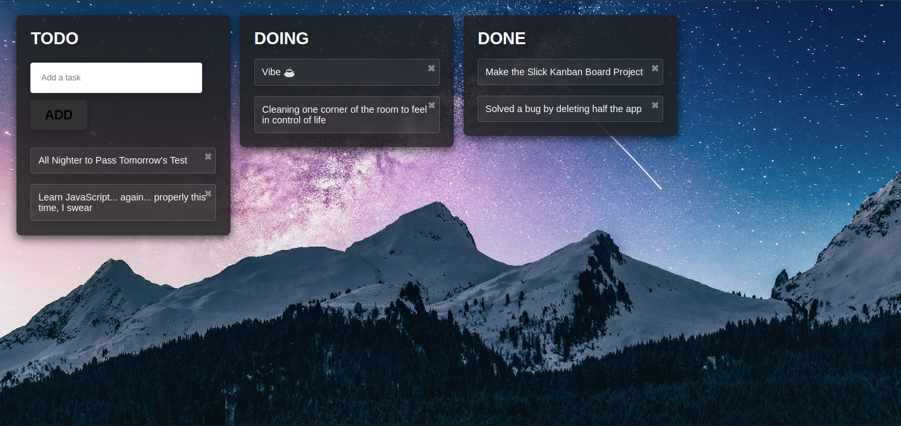

# 🌌 Mini Kanban Board

A minimalist Kanban board built for Zen, productivity and peace of mind. Helps you manage tasks effortlessly while vibing under the stars.

---

## ✨ Features

- **Three-column layout**: `TODO`, `DOING`, and `DONE`
- **Add and Remove task** functionality

- ⚡ **Instant UI feedback** – smooth DOM updates without reloads

- **💾 Persistent Storage**: 
uses `localStorage` to save your tasks directly in your browser. That means your to-do lists stay intact even after refreshing or closing the app.

---

## 🛠️ Tech Stack

- **HTML5** – semantic and structured
- **CSS3** – custom styling and layout
- **Vanilla JavaScript** – simple, fast, and dependency-free

No frameworks. No libraries. Just pure, sleek front-end power.

---

## 📸 A Glimpse of Cosmic Productivity



Background image by Benjamin Voros on Unsplash.
Thank you for capturing the perfect night sky to match our dreams and deadlines.

---

## 🚀 Getting Started

1. Clone the repo:

```bash
git clone https://github.com/TDJR007/mini-kanban-board.git
cd mini-kanban-board
```
2. Open index.html in your browser of choice.

3. Add, move, or delete tasks. Dominate your goals.

---

## 📜 License
This project is open source and free to use under the MIT License.
