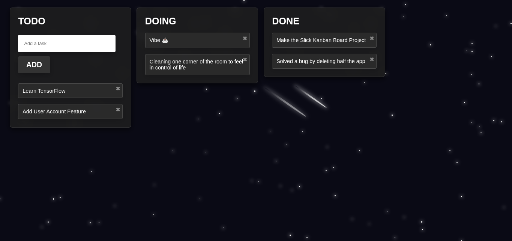

# 🌌 Mini Kanban Board

A minimalist Kanban board built for Zen, productivity and peace of mind. Helps you manage tasks effortlessly while vibing under the stars.

---

## ✨ Features

- **Three-column layout**: `TODO`, `DOING`, and `DONE`
- **Add and Remove task** functionality
- **✨ Animated Cosmic Background**: Floating stars and shooting meteors create an immersive space experience
- **Drag & Drop**: Intuitive task movement between columns
- **⚡ Instant UI feedback** – smooth DOM updates without reloads
- **💾 Persistent Storage**: Uses `localStorage` to save your tasks directly in your browser. That means your to-do lists stay intact even after refreshing or closing the app.

---

## 🛠️ Tech Stack

- **HTML5** – semantic and structured
- **CSS3** – custom styling with advanced animations (keyframes, transforms)
- **Vanilla JavaScript** – simple, fast, and dependency-free
- **CSS Grid & Flexbox** – responsive layout design
- **HTML5 Drag & Drop API** – native browser drag functionality
- **MutationObserver** – dynamic element detection

No frameworks. No libraries. Just pure, sleek front-end power.

---

## 📸 A Glimpse of Cosmic Productivity



---

## 🚀 Getting Started

1. Clone the repo:

```bash
git clone https://github.com/TDJR007/mini-kanban-board.git
cd mini-kanban-board
git fetch origin
git checkout framer-motion
```

2. Open `index.html` in your browser of choice.

3. Add, move, or delete tasks under the animated cosmic sky. Dominate your goals among the stars.

---

## 📜 License
This project is open source and free to use under the MIT License.

---

*Now with stellar animations that make productivity feel out of this world!* ✨
